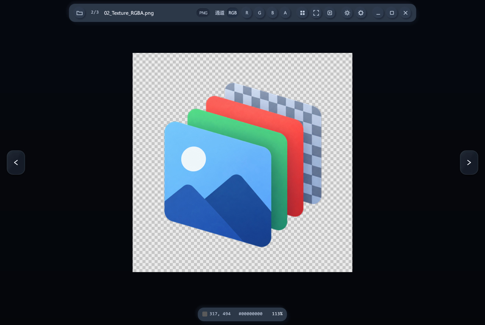
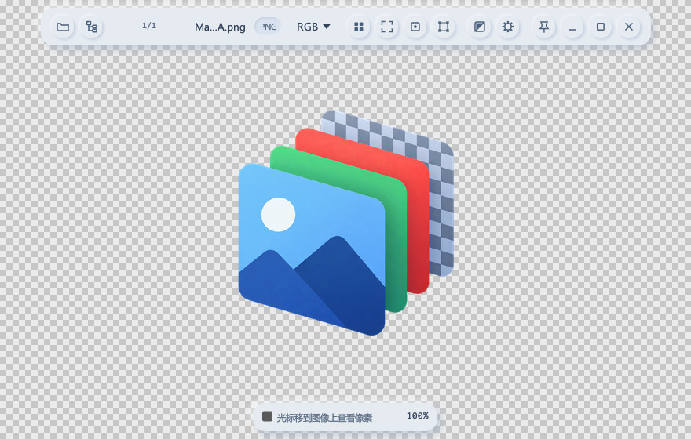
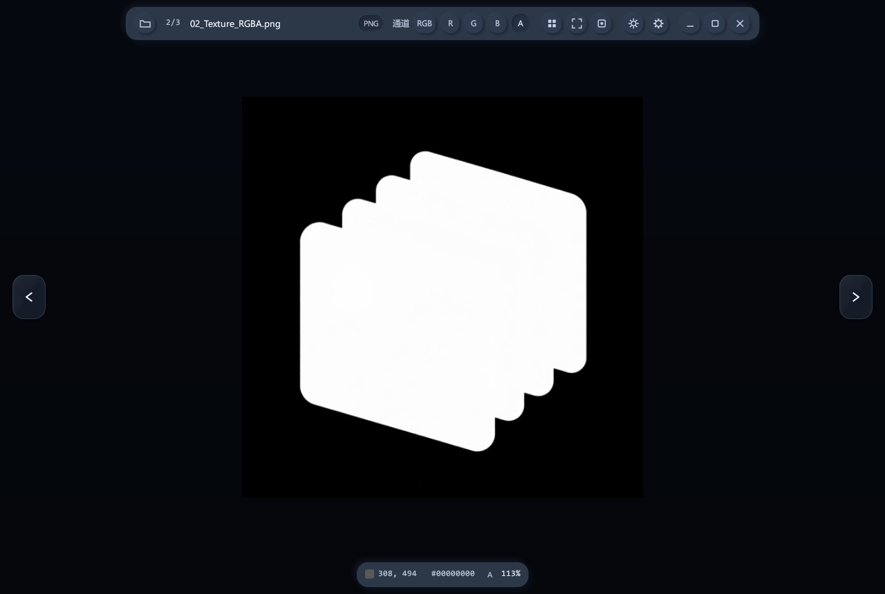

# LcL ImageViewer

**轻量级 Windows 图片查看器，适合日常看图与游戏贴图检查。**

支持 RGBA 通道切换、像素检查，以及 DDS、TGA、PSD 等常用游戏资源格式。

[下载使用](https://github.com/csdjk/LcL_ImageViewer/releases/latest) · [操作说明](#操作说明) · [反馈问题](https://github.com/csdjk/LcL_ImageViewer/issues)

## 主要功能

| 功能 | 说明 |
| --- | --- |
| **RGBA 通道查看** | 一键查看 R / G / B / Alpha，也可忽略透明度查看 RGB，方便检查透明边缘与遮罩贴图 |
| **图片边界** | 顶部工具栏可高亮图片完整边界，包含透明留白；支持随缩放和拖动跟随显示 |
| **像素检查** | 查看鼠标位置的像素坐标与 RGBA 色值，支持复制像素值 |
| **图片浏览** | 同目录快速切图，可开启“包含子文件夹”向下浏览；滚轮缩放、拖拽平移，支持适配窗口、实际大小和最近邻 / 双线性采样 |
| **贴图检查** | 查看图片自带的 Mipmap 层级，调节 HDR 曝光，查看尺寸、格式与压缩信息 |
| **动画查看** | GIF、APNG、动态 WebP / AVIF 播放 / 暂停、逐帧查看与进度控制 |
| **文件操作** | 复制文件路径、打开所在文件夹，确认后将图片移入回收站 |
| **窗口置顶** | 顶部图钉按钮开启 / 取消置顶，切图不改变置顶状态，重启后保留选择 |
| **外观设置** | 顶部背景菜单可选棋盘格、跟随主题、黑 / 白 / 灰或自定义颜色；另有深浅主题、可选磨砂与减少动效；悬浮工具栏无操作 1 秒后自动淡出 |

## 界面预览

<table>
  <tr>
    <td width="50%"></td>
    <td width="50%"></td>
  </tr>
  <tr>
    <td align="center">深色主题</td>
    <td align="center">浅色主题</td>
  </tr>
</table>

查看 Alpha 通道预览

## 支持格式

**常见图片：** PNG、JPG / JPEG、BMP、TIFF、ICO、GIF、WebP、APNG、AVIF。

AVIF 支持透明通道与动态图片循环播放，可暂停、逐帧查看；宽窗口下可拖动帧进度。10/12 位输入转换为 8 位显示，暂不支持 AVIF HDR / ICC 色彩管理。

**游戏贴图与其他格式：** DDS（BC1–BC7）、TGA、PSD、QOI、HDR、PPM / PGM / PBM。

PSD 查看已保存的合成图，不支持图层编辑或 PSB 文件。

## 下载与安装

前往 **[下载页面](https://github.com/csdjk/LcL_ImageViewer/releases/latest)**，选择适合的安装方式：

| 文件 | 使用方式 |
| --- | --- |
| **安装版：带 `Setup` 的 `.exe`** | 双击安装，提供开始菜单入口，可选添加“打开方式”和 DDS、TGA、PSD、WebP、AVIF 等格式的资源管理器缩略图 |
| **免安装版：`.zip`** | 解压后运行 `imageview.exe` |

全新安装默认使用 `D:\Program Files\LcL ImageViewer`，没有 D 盘时使用当前用户目录。安装位置可以手动选择；升级时沿用原目录，安装前请先关闭旧版本。

需要添加到图片的“打开方式”时，也可以在软件中进入 **设置 → 打开方式 → 注册**。默认看图软件由你在系统设置中选择，程序不会自动更换。

## 操作说明

将图片拖进窗口，或按 **`Ctrl+O`** 打开。通过顶部通道按钮查看 RGBA，使用窗口两侧按钮切换图片。

### 鼠标操作

| 操作 | 功能 |
| --- | --- |
| 左键 / 中键拖拽图片 | 移动图片 |
| 右键拖拽画布 | 移动整个窗口 |
| 右键单击 | 打开菜单 |
| 滚轮 | 以鼠标位置为中心缩放 |
| 拖拽窗口边缘 | 调整窗口大小 |
| 拖拽设置弹窗标题 | 只移动设置弹窗 |

### 快捷键

| 按键 | 功能 |
| --- | --- |
| **`1` / `2` / `3` / `4`** | **查看 R / G / B / Alpha 单通道** |
| **`5` 或 `C`** | **恢复完整彩色显示，保留透明度** |
| **`O`** | **忽略透明度查看 RGB；按 `5` 或 `C` 恢复** |
| `A` / `D`、`←` / `→`、`PgUp` / `PgDn` | 上一张 / 下一张 |
| `Home` / `End` | 第一张 / 最后一张 |
| `F` / `0` | 适配窗口 / 实际大小（100%） |
| `N` | 切换最近邻 / 双线性采样 |
| `B` | 显示 / 隐藏图片边界 |
| `S` | 开启 / 关闭包含子文件夹；开启时以当前图片所在目录为范围，只向下查找 |
| `↑` / `↓` | 切换图片自带的 Mipmap 层级 |
| `Space` | 动画播放 / 暂停 |
| `,` / `.` | 动画上一帧 / 下一帧 |
| `T` | 切换深浅主题 |
| `Delete` | 确认后将图片移入回收站 |
| `Esc` | 关闭菜单或弹窗；没有弹层时退出 |

---

[问题反馈](https://github.com/csdjk/LcL_ImageViewer/issues) · [MIT License](LICENSE)
