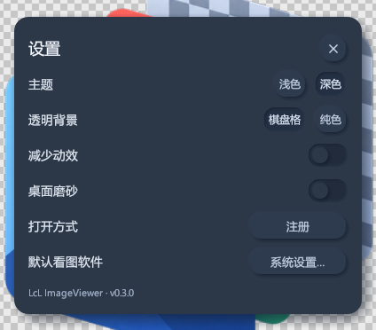
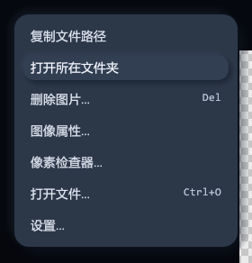

<div align="center">


# LcL ImageViewer

**轻量级 Windows 图片查看器，为游戏美术、贴图检查与日常看图设计。**

[](https://github.com/csdjk/LcL_ImageViewer/releases/latest)
[](https://github.com/csdjk/LcL_ImageViewer/releases/latest)
[](LICENSE)
[](https://www.rust-lang.org/)

[下载安装包](https://github.com/csdjk/LcL_ImageViewer/releases/latest) · [更新日志](CHANGELOG.md) · [反馈问题](https://github.com/csdjk/LcL_ImageViewer/issues)

</div>

## 界面预览

以下均为 **v0.3.0 实际运行截图**。示例使用项目自身的图标素材，桌面磨砂关闭，避免显示桌面内容。

### 深色主题


### 浅色主题


<table>
  <tr>
    <td width="50%"></td>
    <td width="50%"></td>
  </tr>
  <tr>
    <td align="center">紧凑设置 · 标题拖动只移动弹窗</td>
    <td align="center">精简菜单 · 只保留常用文件操作</td>
  </tr>
</table>

## v0.3.0 更新

新拟态深浅主题、窗口两侧的半透明磨砂切图按钮，以及 **1 秒无操作后自动淡出**的悬浮工具栏。右键菜单与设置页去掉冗余分类；设置弹窗可以独立拖动。

操作同步调整为 **左键拖图、画布右键拖主窗口、A / D 切图**。按 `Delete` 会先确认，再将当前图片移入回收站；“打开所在文件夹”直接打开当前图片的父目录。

## 主要功能

| 方向 | 能力 |
| --- | --- |
| 游戏贴图 | DDS（BC1–BC7）、PSD、TGA、QOI、HDR、PNM，以及常见 PNG / JPG / BMP / TIFF / ICO 格式 |
| RGBA 检查 | R、G、B、Alpha 单通道查看；保留透明度或忽略 Alpha；棋盘格 / 纯色衬底 |
| Mipmap 与采样 | 多 Mip 图片切换层级；最近邻 / 双线性采样；HDR 曝光调节 |
| 像素检查 | 光标处像素坐标、RGBA8 十六进制 / 十进制与浮点读数；复制像素值 |
| 动画 | GIF / WebP / APNG 播放暂停、逐帧查看与帧进度控制 |
| 日常看图 | 同目录导航、鼠标缩放和平移、适配窗口、实际大小、复制路径、打开所在文件夹 |
| 外观 | 深浅主题、柔和新拟态控件、侧边磨砂导航、可选桌面磨砂背景、减少动效 |
| Windows 集成 | 可选“打开方式”注册和资源管理器缩略图扩展，不自动替用户选择系统默认应用 |

<details>
<summary>查看 Alpha 通道实机示例</summary>


</details>

## 下载与使用

前往 [GitHub Releases](https://github.com/csdjk/LcL_ImageViewer/releases/latest)。

| 文件 | 用途 |
| --- | --- |
| `LcL-ImageViewer-Setup-v0.3.0-win64.exe` | 安装版：当前用户安装，提供开始菜单入口和卸载器；文件关联、缩略图注册可在安装时选择 |
| `LcL-ImageViewer-v0.3.0-win64.zip` | 免安装包：解压后运行 `imageview.exe`；包含可选缩略图扩展、脚本、使用说明和更新日志 |
| `SHA256SUMS.txt` | 安装包与免安装包的 SHA-256 校验值 |

发布包暂未配置代码签名；下载后可用 `Get-FileHash` 与 `SHA256SUMS.txt` 核对文件完整性。

首次打开可将图片拖进窗口，或使用 `Ctrl+O` 选择文件。图片打开后，`A / D` 或 `← / →` 浏览同目录图片；到达首尾时不循环。

升级前关闭旧查看器。安装版使用安装向导升级；免安装版建议解压到新目录后启动，避免误开旧的 EXE。开发目录中的 Debug、Release 与其他安装副本是独立文件，不会同时自动更新。界面偏好保存在当前用户的 `%APPDATA%\LcL ImageViewer` 下，免安装并不代表配置也保存于 EXE 旁边。

## 安装后未出现在“打开方式”中

v0.3.0 首次发布的安装包有注册表值遗漏问题，已勾选“打开方式”也可能只生成空键。可先打开**实际安装目录**中的 `imageview.exe`，进入 **设置 → 打开方式 → 注册**，再重新打开资源管理器的“打开方式”菜单。不要从工程的 Debug/Release 副本启动后注册，以免登记到临时程序路径。

安装器源码已补齐显式值类型与关联刷新。本地修正版与公开原附件分开保存；未覆盖原 GitHub 下载文件。详见[安装器修复及验证记录](docs/releases/openwith-installer-fix.md)。

## 鼠标操作

| 操作区域 / 手势 | 效果 |
| --- | --- |
| 画布左键或中键拖拽 | 移动图片，主窗口不动 |
| 画布右键拖拽 | 移动整个查看器窗口 |
| 画布右键单击 | 打开精简菜单；拖动结束不会误弹菜单 |
| 设置标题或标题内空白处，左键 / 右键拖拽 | 只移动内部设置弹窗，主窗口不动；当前会话中保留位置 |
| 滚轮 | 以光标所在位置为中心缩放图片 |
| 窗口边缘左键拖拽 | 调整主窗口大小 |

设置中的按钮、开关、滑条不属于标题拖动区。设置弹窗限制在查看器内部，避免拖出可操作范围。

## 快捷键

| 按键 | 功能 |
| --- | --- |
| `Ctrl+O` | 打开图片 |
| `A` / `D`、`←` / `→`、`PgUp` / `PgDn` | 同目录上一张 / 下一张 |
| `Home` / `End` | 同目录第一张 / 最后一张 |
| `1` / `2` / `3` / `4` | R / G / B / Alpha 单通道 |
| `5` 或 `C` | 恢复 RGB 色彩与原图透明度 |
| `O` | 忽略 Alpha |
| `F` | 适配窗口 |
| `0` | 实际大小 100% |
| `N` | 最近邻 / 双线性采样 |
| `↑` / `↓` | Mip 索引增加 / 减少（图片须包含多个 Mip） |
| `Space` | 动画播放 / 暂停 |
| `,` / `.` | 动画上一帧 / 下一帧 |
| `T` | 深色 / 浅色主题 |
| `Delete` | 确认后将当前图片移入回收站 |
| `Esc` | 优先关闭菜单、确认框或设置等弹层；无弹层时退出 |

文字输入或相关弹层操作时，不会误触发 A/D 切图或删除。Delete 不响应组合键或长按连发，**没有 Shift+Delete 永久删除入口**。取消不改变文件；删除成功后优先显示下一张，末尾回退到上一张，全部删完则回到空白状态。

## 可选缩略图扩展

`iv_shell.dll` 为 `.dds .tga .psd .qoi .hdr .ppm .pgm .pbm` 提供资源管理器缩略图。

安装版可勾选相应选项；免安装版可在保留 EXE/DLL 的固定目录中手动运行：

```powershell
# 在解压目录中运行；脚本优先使用旁边的 iv_shell.dll
powershell -NoProfile -ExecutionPolicy Bypass -File .\register_thumbnail.ps1

# 移除本扩展的注册
powershell -NoProfile -ExecutionPolicy Bypass -File .\unregister_thumbnail.ps1
```

注册只写入当前用户的 HKCU。缩略图扩展是可选项，普通看图不依赖注册；启用前注意与其他图片软件的缩略图处理器可能存在占用关系。移动或删除免安装目录前，应先解除缩略图注册。

## 从源码构建

需要 Windows x64 Rust 工具链；MSVC 构建需对应的 C++ Build Tools / Windows SDK。制作安装包另需 Inno Setup 7。

```powershell
cargo test --workspace --locked
cargo build --release --workspace --locked

# 主程序与可选扩展
# target\release\imageview.exe
# target\release\iv_shell.dll

# 指定已安装或便携版 ISCC.exe，生成安装包、ZIP 和 SHA256SUMS.txt
python tools/package_release.py --iscc "C:\Path\To\Inno Setup 7\ISCC.exe"
# 输出：dist/v0.3.0/
```

## 验证范围与限制

本轮主要在 Windows、100% 缩放下验证深浅主题、两种窗口尺寸及文件/菜单/拖拽交互。其他 DPI、混合缩放、多显示器、全部 HDR/动画组合和桌面捕获性能仍需更多回归；不承诺覆盖所有环境。桌面磨砂为应用自身捕获与模糊实现，受系统捕获能力影响。回收站无法使用时应取消操作，不提供永久删除回退。

发布说明见 [v0.3.0](docs/releases/v0.3.0.md)。

<details>
<summary>开发协作与验收文档</summary>

- [AGENTS.md](AGENTS.md)：开发协作入口。
- [当前状态](docs/status.md) · [任务板](docs/task-board.md) · [路线图](docs/roadmap.md)。
- [新拟态规范](docs/新拟态UI规范.md) · [设置弹窗拖动验收](docs/ui-qa/设置弹窗独立拖动验收.md)。

</details>

## License

[MIT](LICENSE)
