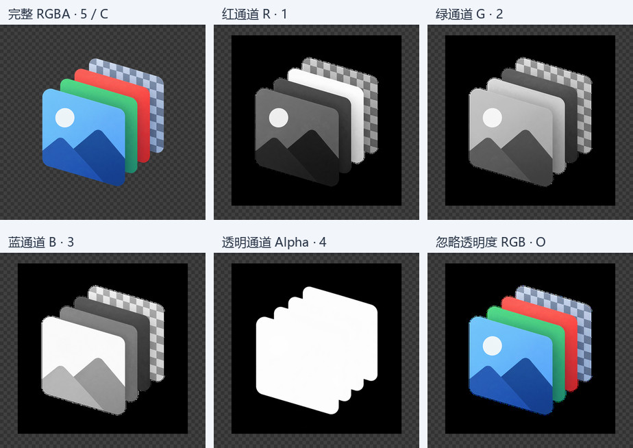
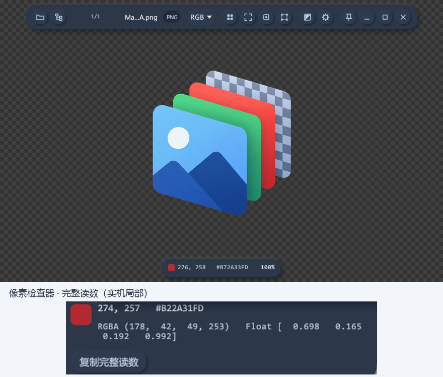
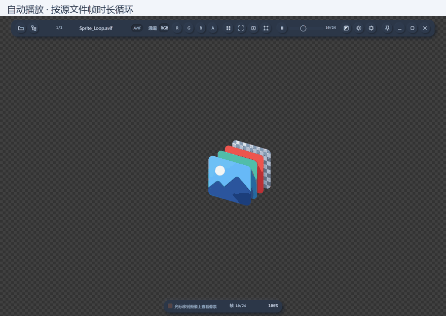
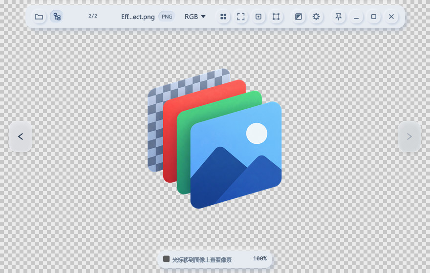
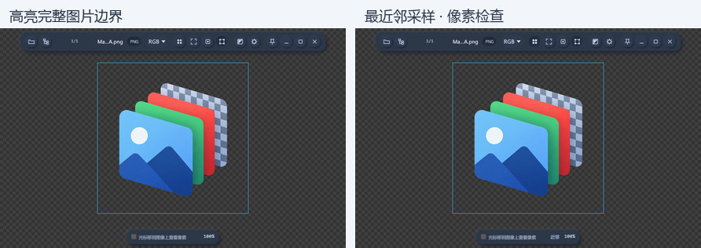
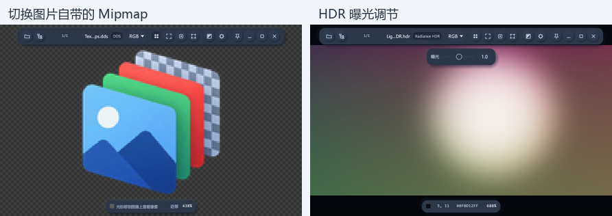
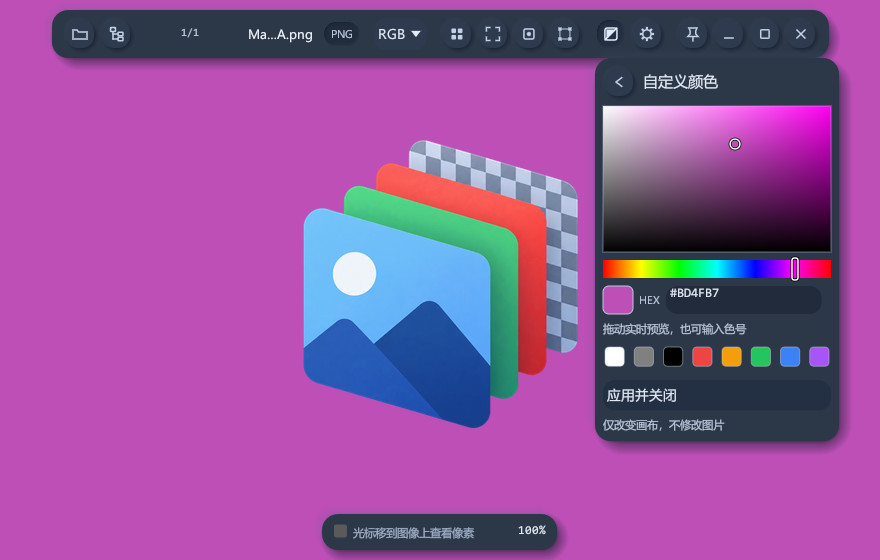
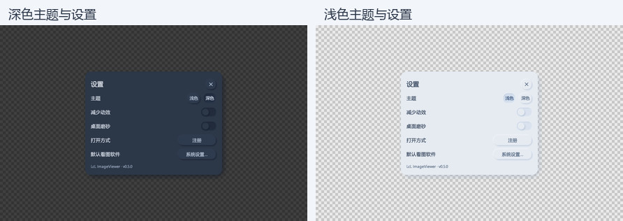
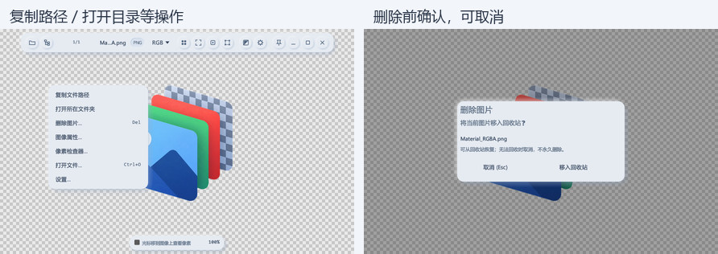
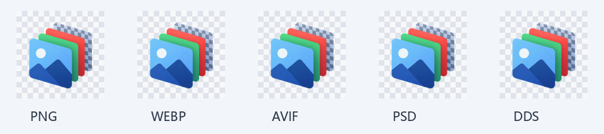

# LcL ImageViewer

**轻量级 Windows 图片查看器，适合日常看图与游戏贴图检查。**

RGBA 通道查看 · 动画播放与逐帧检查 · DDS / TGA / PSD / AVIF · 背景调色板 · 窗口置顶

[下载使用](https://github.com/csdjk/LcL_ImageViewer/releases/latest) · [功能图解](#功能图解) · [快捷键](#快捷键) · [反馈问题](https://github.com/csdjk/LcL_ImageViewer/issues)

## 下载与安装

在 **[最新版本](https://github.com/csdjk/LcL_ImageViewer/releases/latest)** 页面选择：

| 文件 | 使用方式 |
| --- | --- |
| **安装版：带 `Setup` 的 `.exe`** | 双击安装；可选加入“打开方式”和资源管理器缩略图 |
| **免安装版：`.zip`** | 解压后运行 `imageview.exe`，普通看图无需注册 DLL |
| `SHA256SUMS.txt` | 校验下载文件是否完整 |

升级前先关闭旧版本。升级沿用原安装目录；全新安装默认使用 `D:\Program Files\LcL ImageViewer`，没有 D 盘时使用当前用户目录，安装位置也可手动修改。程序不会擅自更改系统默认看图软件。

**macOS 预览版：** 已新增 Apple Silicon / Intel 云端构建入口，安装方式、签名状态和平台差异见 [macOS 构建说明](docs/releases/macos.md)。下方功能配图为 Windows 版本实机图。

## 功能图解

### RGBA 单独切换查看

按 **`1 / 2 / 3 / 4`** 查看 R、G、B、Alpha 单通道，**`5` 或 `C`** 恢复完整彩色，**`O`** 忽略透明度。适合检查遮罩、透明边缘和各通道贴图；顶部也可直接切换。

### 像素检查与取色

鼠标移到图片上即可查看像素坐标和 RGBA 值。右键可复制当前像素值，也可打开“像素检查器”查看完整读数。

### 动画播放、暂停与逐帧查看

支持 **GIF、APNG、动态 WebP 和 AVIF**。按 **`Space`** 播放 / 暂停，按 **`,` / `.`** 查看上一帧 / 下一帧；宽窗口下可拖动帧进度条定位，拖动后保持暂停。

下图依次演示：**自动播放 → 暂停 → 逐帧 → 继续播放**。

### 同目录与子文件夹浏览

使用窗口两侧按钮、**`A / D`** 或方向键切换图片。顶部“包含子文件夹”按钮 / **`S`** 可向下浏览当前目录的子文件夹；子目录图片显示相对路径，便于区分同名素材。

### 缩放、平移、采样与图片边界

滚轮以鼠标位置为中心缩放，左键 / 中键拖动图片；**`F`** 适配窗口，**`0`** 查看实际大小。**`N`** 切换最近邻 / 双线性采样，**`B`** 高亮图片完整边界，透明留白也包括在内。

### 保存后刷新与视图锁定

默认自动检查当前文件的变化，连续保存稳定后更新画面；刷新保留缩放、位置、通道、有效 Mip 和曝光。按 **F5** 可立即重新读取，包括文件时间和大小均未变化的情况。刷新失败保留上一版本并显示错误，后续保存或 F5 可重试。

按 **L** 或使用右键菜单开启“锁定切图视图”，切换图片也保留检查位置；按 **F** 可重新适配窗口。设置中的“自动刷新”和“锁定切图视图”会保存。自动检查只读取当前文件元数据，不索引整个项目。

### Mipmap 与 HDR 贴图检查

查看 DDS 等图片自带的 Mipmap，使用 **`↑ / ↓`** 切换层级。HDR 图片可调节曝光；相关图片工具会根据格式显示，窄窗口下放在顶部的第二行。

### 窗口置顶

点击顶部 **图钉按钮** 开启 / 取消置顶，方便对照其他软件中的素材。切图、最小化恢复和重启后保留选择。

### 背景切换与调色板

顶部背景菜单可选 **棋盘格、跟随主题、白色、灰色、黑色**。自定义颜色使用二维色板、彩虹色相条、HEX 色号和快捷色块，选色时实时预览。

背景与界面主题独立，选择会保存；只改变画布和透明区域的显示，不修改原图或通道数据。

### 深浅主题与外观设置

按 **`T`** 切换深浅主题；设置中可调整桌面磨砂、减少动效等选项。悬浮工具栏无操作 1 秒后自动淡出，移动鼠标恢复；背景调色菜单打开时保持可见。

### 文件操作与安全删除

右键菜单提供复制路径、打开所在文件夹、图像属性和设置等常用操作。按 **`Delete`** 会先确认，再将图片移入回收站；取消不会修改文件，回收站不可用时也不会改为永久删除。

### 资源管理器缩略图

安装时可选择启用 **DDS、TGA、PSD、WebP、AVIF、QOI、HDR、PPM / PGM / PBM** 缩略图。动态图片使用首帧；普通看图无需启用此扩展。

下方为同一张素材通过查看器缩略图组件生成的输出示例。

## 支持格式

**常见图片：** PNG、JPG / JPEG、BMP、TIFF、ICO、GIF、WebP、APNG、AVIF。

**游戏贴图与其他格式：** DDS（BC1–BC7）、TGA、PSD、QOI、HDR、PPM / PGM / PBM。

AVIF 支持透明通道和动画循环播放；10 / 12 位输入转换为 8 位显示，暂不支持 AVIF HDR 映射、ICC 色彩管理或按文件有限循环次数自动停止。PSD 查看已保存的合成图，不支持图层编辑和 PSB 文件。

BC6H 当前为 8 位预览，未保留 HDR 浮点值；DDS BC4/BC5 的 SNORM 及 typeless 变体会明确提示不支持。普通 16 位 PNG/TIFF 仍转换为 8 位显示。GIF/APNG/WebP/AVIF 的完整动画保留像素限制为 **256.00 MiB**（含单独首帧），最多 4096 帧；超限会报错，此限制不是进程总内存上限。

## 鼠标操作

| 操作 | 功能 |
| --- | --- |
| 拖入图片 / `Ctrl+O` | 打开图片 |
| 左键 / 中键拖拽图片 | 平移图片 |
| 右键拖拽画布 | 移动整个窗口 |
| 右键单击 | 打开菜单 |
| 滚轮 | 以鼠标为中心缩放 |
| 拖拽窗口边缘 | 调整窗口大小 |
| 拖拽设置弹窗标题 | 只移动设置弹窗 |

## 快捷键

| 按键 | 功能 |
| --- | --- |
| **`1 / 2 / 3 / 4`** | **R / G / B / Alpha 单通道** |
| **`5` / `C`；`O`** | **完整彩色；忽略透明度** |
| `A / D`、`← / →`、`PgUp / PgDn` | 上一张 / 下一张 |
| `Home / End` | 第一张 / 最后一张 |
| `F / 0` | 适配窗口 / 实际大小 |
| `F5` | 重新读取当前图片并保留检查位置 |
| `L` | 锁定 / 解锁切图视图 |
| `N` | 最近邻 / 双线性采样 |
| `B` | 显示 / 隐藏图片边界 |
| `S` | 开启 / 关闭向下浏览子文件夹 |
| `↑ / ↓` | 切换 Mipmap 层级 |
| `Space` | 动画播放 / 暂停 |
| `, / .` | 动画上一帧 / 下一帧 |
| `T` | 切换深浅主题 |
| `Delete` | 确认后移入回收站 |
| `Esc` | 关闭菜单或弹窗；没有弹层时退出 |

需要加入 Windows 的“打开方式”时，可进入 **设置 → 打开方式 → 注册**；默认看图软件由你在系统设置中确认。

---

[问题反馈](https://github.com/csdjk/LcL_ImageViewer/issues) · [更新日志](CHANGELOG.md) · [MIT License](LICENSE)
